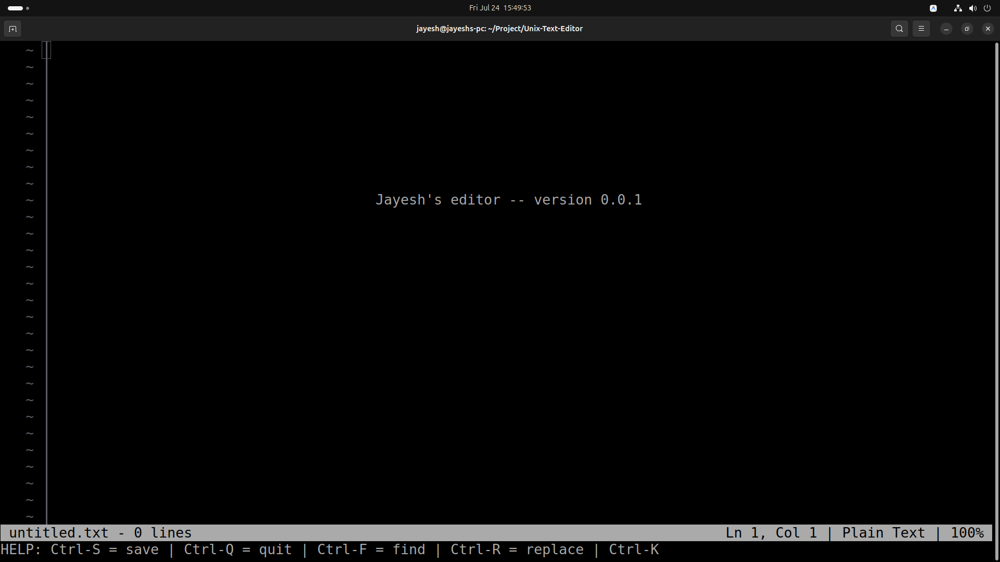

<div align="center">

# 📝 Jayesh's Unix Text Editor

**A high-performance, lightweight, zero-dependency C99 terminal text editor.**


*Inspired by classic terminal editors, engineered with line numbers margin, syntax highlighting, clipboard operations, and interactive search & replace.*

</div>

---

## 📸 Interface Preview

<p align="center">
  
</p>

---

## ✨ Features at a Glance

| Category | Feature | Description |
| :--- | :--- | :--- |
| 🎨 **Visual & UI** | **Line Numbers Gutter** | Dynamic margin width with digit alignment (` 1 │ `, ` 12 │ `) |
| | **Current Line Highlight** | Subtle background accent on the active cursor line |
| | **Dual Status Bar** | Real-time position (`Ln Y, Col X`), syntax mode, file `%`, and dirty state |
| ✏️ **Text Editing** | **Core Editing Engine** | Multi-line insertion, line splitting, joining, and Backspace/Delete |
| | **Interactive "Save As"** | Status-bar prompt to name untitled files upon saving |
| | **Line Clipboard** | Cut line (`Ctrl-K`) to internal buffer and paste (`Ctrl-U`) anywhere |
| 🔍 **Search Engine** | **Incremental Search** | Live matching and cursor jump using `Ctrl-F` |
| | **Search & Replace** | Global string search and replacement across the document (`Ctrl-R`) |
| 🌈 **Syntax Engine** | **C/C++ Highlighting** | Keywords, data types, numbers, strings, single & multi-line comments |
| ⚡ **System** | **Zero Dependencies** | Built using strictly standard C library, `<termios.h>`, and VT100 escapes |
| | **Window Resizing** | Handles terminal dimension changes (`SIGWINCH`) dynamically |

---

## ⌨️ Keyboard Shortcuts

| Action | Shortcut Key | Description |
| :--- | :--- | :--- |
| **Save File** | <kbd>Ctrl</kbd> + <kbd>S</kbd> | Save document to disk (prompts for filename if untitled) |
| **Quit Editor** | <kbd>Ctrl</kbd> + <kbd>Q</kbd> | Exit editor (safely warns 3 times if file has unsaved changes) |
| **Search Text** | <kbd>Ctrl</kbd> + <kbd>F</kbd> | Incremental search (<kbd>↑</kbd>/<kbd>↓</kbd> to jump matches, <kbd>Esc</kbd> to exit) |
| **Search & Replace** | <kbd>Ctrl</kbd> + <kbd>R</kbd> | Prompt for target search string and replacement text |
| **Cut Line** | <kbd>Ctrl</kbd> + <kbd>K</kbd> | Cut current line into internal clipboard buffer |
| **Paste Line** | <kbd>Ctrl</kbd> + <kbd>U</kbd> | Paste line from clipboard buffer into document |
| **Line Jump (Home)** | <kbd>Home</kbd> | Jump cursor to the beginning of the current row |
| **Line Jump (End)** | <kbd>End</kbd> | Jump cursor to the end of the current row |
| **Page Up / Down** | <kbd>Page Up</kbd> / <kbd>Page Down</kbd> | Scroll up or down by one full screen page |
| **Navigation** | <kbd>↑</kbd> <kbd>↓</kbd> <kbd>←</kbd> <kbd>→</kbd> | Move cursor one character/row at a time |

---

## 🚀 Quick Start Guide

### 1. Prerequisites
- **OS**: Linux, macOS, WSL, or POSIX-compliant Unix system
- **Compiler**: `gcc` or `clang` with C99 support

### 2. Build
```bash
# Clone the repository
git clone https://github.com/thejayeshdeore/Unix-Text-Editor.git
cd Unix-Text-Editor

# Compile with Make
make
```

### 3. Usage
```bash
# Launch editor with an empty buffer ("untitled.txt"):
./main

# Open an existing file or create a specific file:
./main main.c

# Clean build artifacts:
make clean
```

---

## 🏗️ Code Architecture

The entire editor logic is cleanly structured inside [`main.c`](file:///home/jayesh/Project/Unix-Text-Editor/main.c):

```
├── main.c
│   ├── Terminal Raw Mode setup & teardown (termios / atexit)
│   ├── Row Storage Engine (erow struct & render buffer)
│   ├── VT100 Escape Screen Renderer (abuf append buffer)
│   ├── Syntax Highlighting Engine (HLDB syntax definitions)
│   ├── Interactive Prompt System (editorPrompt)
│   └── Event Loop & Key Processor (editorProcessKeypress)
└── Makefile (CC, CFLAGS -Wall -Wextra -pedantic -std=c99 -O2)
```
